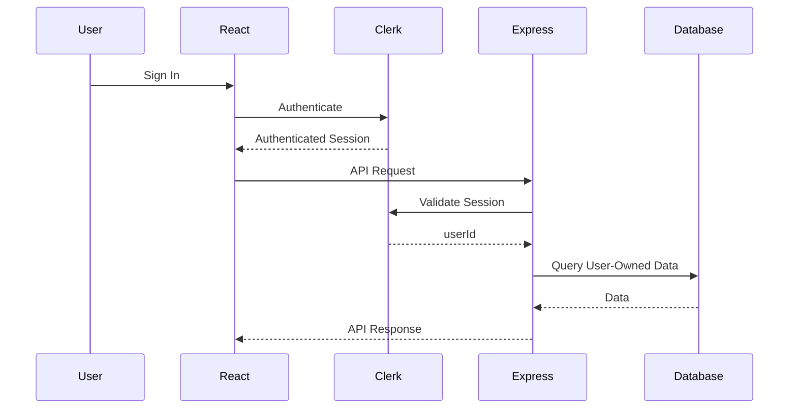
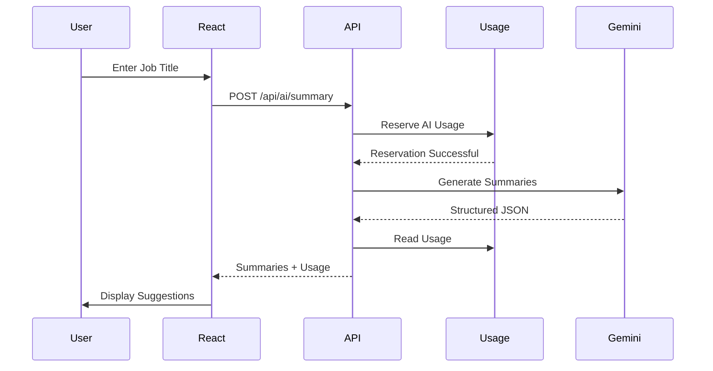
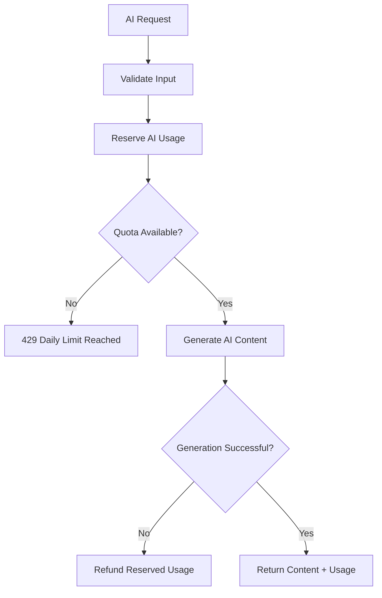
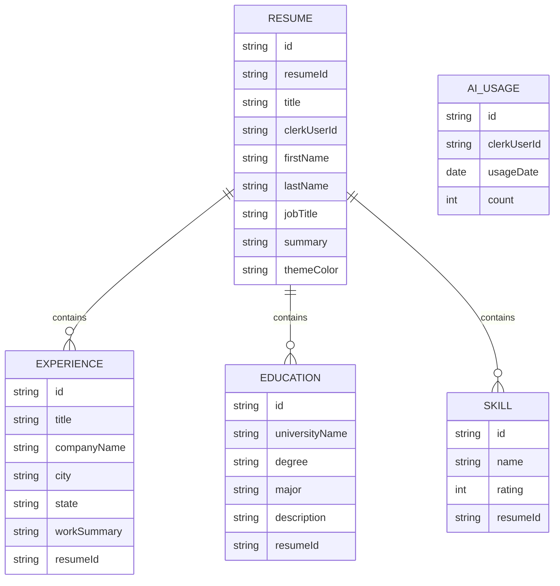

# ResumeFlow — AI-Powered Resume Builder

<div align="center">


**A full-stack, AI-powered resume builder that helps users create professional, ATS-friendly resumes — with AI-assisted content generation, live preview, theming, and shareable resume links.**

</div>

---

## Table of Contents

- [Overview](#overview)
- [Why ResumeFlow](#why-resumeflow)
- [Features](#features)
- [Tech Stack](#tech-stack)
- [Architecture](#architecture)
- [Application Workflow](#application-workflow)
- [Project Structure](#project-structure)
- [Authentication Flow](#authentication-flow)
- [AI Content Generation](#ai-content-generation)
- [AI Usage Quota](#ai-usage-quota)
- [Data Model](#data-model)
- [API Reference](#api-reference)
- [State Management](#state-management)
- [Security](#security)
- [Getting Started](#getting-started)
- [Environment Variables](#environment-variables)
- [Running Locally](#running-locally)
- [Production Build](#production-build)
- [Scripts Reference](#scripts-reference)
- [Engineering Highlights](#engineering-highlights)
- [Technical Tradeoffs](#technical-tradeoffs)
- [Roadmap](#roadmap)
- [What This Project Demonstrates](#what-this-project-demonstrates)
- [License](#license)

---

## Overview

ResumeFlow is a full-stack application that helps users create professional, ATS-friendly resumes with significantly less manual writing. It combines a modern React frontend, a Node.js/Express API, Clerk authentication, PostgreSQL persistence via Prisma, and Google Gemini for AI-assisted content generation.

Users can create multiple resumes, fill in their professional information, generate AI-assisted summaries and experience bullet points, preview the resume in real time, customize the theme, and download or share the finished result.

> Users provide their professional information. ResumeFlow helps transform it into polished, structured resume content — while keeping the user in full control of every AI-generated result before it's saved.

---

## Why ResumeFlow

Most resume builders require users to manually write every section from scratch. ResumeFlow removes the blank-page problem by combining:

- Structured, section-based resume editing
- AI-assisted content generation for summaries and experience
- A single source of truth for resume state, shared between editor and preview
- Real-time visual preview as the user types
- Authentication-aware, per-user data access
- Server-enforced daily AI usage limits

The AI is a starting point, not a replacement — users review and edit every generated result before it's saved.

---

## Features

### AI-Powered Content

- AI-generated professional summaries (Entry, Mid, and Senior variations)
- AI-generated, ATS-friendly experience bullet points
- Action-oriented, HTML-formatted output ready for the rich text editor

### Resume Builder

A complete, guided editing workflow covering:

- Personal details
- Professional summary
- Work experience
- Education
- Skills
- Theme customization
- Live preview

### Multi-Resume Management

Each user can create and manage multiple resumes. Every resume has its own unique ID, title, content, and theme color, independent of the others.

### Customization

- Multiple theme colors, consistently applied across preview sections, headings, and skill indicators
- Visual resume cards on the dashboard

### Live Preview

The editor and preview share the same resume state, so every update to personal details, summary, experience, education, or skills is reflected instantly.

### Download & Share

- Download via the browser print workflow
- Share via the Web Share API
- View any resume through a dedicated public display route

### Authentication & Authorization

Clerk handles authentication end-to-end. The backend verifies every request via Clerk's Express middleware and scopes all resume data to the authenticated user's Clerk ID.

### AI Usage Protection

A server-enforced quota of **5 AI generations per user per UTC day**, shared across summary and experience generation, prevents uncontrolled AI usage.

---

## Tech Stack

### Frontend

| Technology           | Purpose                  |
| -------------------- | ------------------------ |
| React 19             | UI layer                 |
| Vite                 | Build tool & dev server  |
| React Router         | Client-side routing      |
| Tailwind CSS v4      | Styling                  |
| shadcn/ui            | UI primitives            |
| Axios                | HTTP client              |
| Clerk React          | Authentication           |
| Sonner               | Toast notifications      |
| Lucide React         | Icons                    |
| React Simple WYSIWYG | Rich text editing        |
| React Web Share      | Native share integration |
| React Rating         | Skill rating input       |

### Backend

| Technology    | Purpose                    |
| ------------- | -------------------------- |
| Node.js       | Runtime                    |
| Express 5     | HTTP API                   |
| Clerk Express | Authentication middleware  |
| Prisma 7      | ORM                        |
| PostgreSQL    | Relational database        |
| CORS          | Cross-origin configuration |
| dotenv        | Environment configuration  |

### AI

| Technology       | Purpose                   |
| ---------------- | ------------------------- |
| Google GenAI SDK | Gemini API integration    |
| Gemini Flash     | Resume content generation |

### Tooling

PNPM · PNPM Workspaces · ESLint · Git

---

## Architecture

ResumeFlow follows a client-server architecture with clear boundaries between the frontend, API, persistence layer, and AI provider.

```
                    ┌───────────────────┐
                    │       User        │
                    └─────────┬─────────┘
                              │
                              ▼
                    ┌───────────────────┐
                    │  React + Vite     │
                    │    Frontend       │
                    └─────────┬─────────┘
                              │
                          Axios API
                              │
                              ▼
                    ┌───────────────────┐
                    │   Express API     │
                    │     Server        │
                    └────┬─────────┬────┘
                         │         │
                    Clerk Auth     │
                         │         │
              ┌──────────┴───┐  ┌──┴──────────────┐
              ▼               │  ▼                 │
     ┌──────────────────┐    │ ┌──────────────────┐
     │   PostgreSQL      │   │ │  Google Gemini    │
     │   Database         │   │ │       AI          │
     └──────────────────┘    │ └──────────────────┘
```

The backend itself follows a layered request pipeline:

```
HTTP Request → Routes → Middleware → Controllers → Services → Prisma → PostgreSQL
```

- **Routes** define API boundaries and authentication requirements.
- **Middleware** validates the authenticated Clerk session.
- **Controllers** orchestrate the HTTP request/response cycle.
- **Services** hold reusable business logic (AI generation, usage tracking).
- **Prisma** provides typed, transactional database access.

---

## Application Workflow

```mermaid
flowchart LR
    A[User Opens ResumeFlow] --> B[Authenticate with Clerk]
    B --> C[Open Dashboard]
    C --> D[Create Resume]
    D --> E[Enter Personal Details]
    E --> F[Generate AI Summary]
    F --> G[Add Experience]
    G --> H[Generate AI Experience Content]
    H --> I[Add Education and Skills]
    I --> J[Customize Theme]
    J --> K[Preview Resume]
    K --> L[Download or Share]
```



---

## Project Structure

```text
ResumeFlow/
├── public/
│   ├── cv.png
│   ├── favicon.svg
│   ├── icons.svg
│   └── logo.svg
│
├── src/
│   ├── auth/sign-in/
│   ├── components/
│   │   ├── custom/
│   │   └── ui/
│   ├── context/
│   │   └── ResumeInfoContext.jsx
│   ├── dashboard/
│   │   ├── components/
│   │   ├── resume/
│   │   │   ├── components/
│   │   │   └── [resumeId]/edit/
│   │   └── index.jsx
│   ├── hooks/
│   │   ├── useAiUsage.js
│   │   └── useAxiosClient.js
│   ├── home/
│   ├── individualresume/[resumeId]/display/
│   ├── prompts/
│   │   ├── experience.prompt.js
│   │   └── summary.prompt.js
│   ├── services/
│   │   ├── GlobalApi.js
│   │   └── PublicApi.js
│   ├── App.jsx
│   ├── main.jsx
│   └── index.css
│
├── server/
│   ├── prisma/
│   │   ├── migrations/
│   │   └── schema.prisma
│   └── src/
│       ├── controllers/
│       │   ├── ai.controller.js
│       │   └── resume.controller.js
│       ├── db/prisma.js
│       ├── middleware/auth.middleware.js
│       ├── routes/
│       │   ├── ai.routes.js
│       │   └── resume.routes.js
│       ├── services/
│       │   ├── ai-usage.service.js
│       │   └── gemini.service.js
│       └── server.js
│
├── package.json
├── pnpm-workspace.yaml
├── vite.config.js
└── README.md
```

---

## Authentication Flow

Authentication is handled entirely by Clerk.



The frontend attaches the Clerk session token to every request:

```http
Authorization: Bearer <token>
```

The backend extracts and verifies the authenticated user's identity via Clerk's Express middleware, and every resume operation is scoped to that `clerkUserId`.

---

## AI Content Generation

AI generation runs entirely on the backend, keeping the Gemini API key out of the browser.

```
React → AI Controller → AI Usage Service → Gemini Service → Gemini API
```

### Summary Generation



Given a job title, the AI returns three summary variations:

| Level  | Purpose                              |
| ------ | ------------------------------------ |
| Entry  | Early-career positioning             |
| Mid    | Experienced professional positioning |
| Senior | Advanced professional positioning    |

### Experience Generation

Experience content is returned as formatted HTML (`<ul><li>...</li></ul>`) and rendered directly inside the rich text editor, where it can be reviewed and edited before saving. Generation constraints include:

- ATS-friendly, action-oriented language
- 5–7 bullet points
- No invented companies
- No repetition of the job title
- No references to seniority level

---

## AI Usage Quota

```
Daily Limit = 5 generations per user (UTC)
```

Usage is tracked per `clerkUserId + usageDate`.



**Reservation strategy:**

1. Create the daily usage record if it doesn't exist.
2. Attempt to increment the usage count.
3. The increment only succeeds while the count is below the daily limit.
4. AI generation proceeds only after a successful reservation.
5. If generation fails, the reserved usage is refunded — so failed requests never permanently consume quota.

---

## Data Model



**Design decisions:**

- **Separate resume sections** — Experiences, education, and skills are stored as distinct relational models, giving clear data boundaries, independent section updates, and cascade deletion.
- **Ownership indexing** — The `Resume` model indexes `clerkUserId` for efficient per-user queries.
- **Daily AI uniqueness** — `AiUsage` enforces a composite unique constraint on `clerkUserId + usageDate`, guaranteeing exactly one usage record per user per day.

---

## API Reference

### Resume Endpoints

| Method   | Endpoint                             | Description                           |
| -------- | ------------------------------------ | ------------------------------------- |
| `POST`   | `/api/resumes`                       | Create a resume                       |
| `GET`    | `/api/resumes`                       | List the authenticated user's resumes |
| `GET`    | `/api/resumes/:resumeId`             | Get a single resume                   |
| `PATCH`  | `/api/resumes/:resumeId`             | Update resume details                 |
| `PUT`    | `/api/resumes/:resumeId/skills`      | Replace skills                        |
| `PUT`    | `/api/resumes/:resumeId/experiences` | Replace experiences                   |
| `PUT`    | `/api/resumes/:resumeId/education`   | Replace education                     |
| `DELETE` | `/api/resumes/:resumeId`             | Delete a resume                       |

### AI Endpoints

| Method | Endpoint             | Description                 |
| ------ | -------------------- | --------------------------- |
| `POST` | `/api/ai/summary`    | Generate resume summaries   |
| `POST` | `/api/ai/experience` | Generate experience content |
| `GET`  | `/api/ai/usage`      | Get current AI usage        |

All API calls are centralized through `src/services/GlobalApi.js`, with the Axios client injected in:

```js
const api = GlobalApi(axiosClient);
```

This keeps endpoint definitions in one place instead of scattered across the UI.

---

## State Management

ResumeFlow uses React Context to share resume state between the editor and the preview:

```
EditResume
  └── ResumeInfoContext.Provider
        ├── FormSection
        │     ├── PersonalDetail
        │     ├── Summary
        │     ├── Experience
        │     ├── Education
        │     └── Skills
        └── ResumePreview
```

Every form update flows through the shared context and is reflected immediately in the preview:

```
Form Input → ResumeInfoContext → Resume Preview
```

AI usage state is also centralized within the editing workflow, so the Summary and Experience sections always display a consistent remaining quota.

### Rich Text Experience Editing

The experience editor (`react-simple-wysiwyg`) is fully controlled by parent state, so manually typed and AI-generated content follow the same update path — there's no separate source of truth to drift out of sync:

```
Experience State → RichTextEditor value → WYSIWYG Editor → onChange → Experience State
```

### Resume Preview

The preview is composed of independent section components — `PersonalDetailPreview`, `SummaryPreview`, `ExperiencePreview`, `EducationalPreview`, and `SkillsPreview` — each reading from the shared context, with theme color applied consistently across headings, borders, and skill indicators.

---

## Security

- **API key protection** — The Gemini API key is only ever accessed server-side; it's never exposed to the browser.
- **Authentication-aware data access** — Every resume request is protected by Clerk's authentication middleware and scoped to the requesting user's `clerkUserId`. Ownership is verified before any read or write.
- **Input validation** — The backend validates required fields (resume titles, job titles, position titles) and array-shaped resume sections before touching the database.
- **Server-enforced AI quota** — Usage limits are enforced entirely on the backend; the frontend is never trusted to self-limit.

---

## Getting Started

### Prerequisites

- Node.js 20+
- PNPM
- PostgreSQL
- Git
- A Clerk application
- A Google Gemini API key

### Clone & Install

```bash
git clone <your-repository-url>
cd ResumeFlow

# Frontend dependencies
pnpm install

# Backend dependencies
cd server
pnpm install
```

---

## Environment Variables

### Frontend — `.env` (project root)

```env
VITE_API_BASE_URL=http://localhost:5000
VITE_BASE_URL=http://localhost:5173
VITE_CLERK_PUBLISHABLE_KEY=your_clerk_publishable_key
```

### Backend — `server/.env`

```env
PORT=5000
CLIENT_URL=http://localhost:5173
DATABASE_URL=your_postgresql_connection_string
DIRECT_URL=your_direct_postgresql_connection_string
GEMINI_API_KEY=your_gemini_api_key
```

> **Important:** Never commit `.env` files or API keys to version control.

---

## Running Locally

### 1. Set up the database

```bash
cd server
pnpm exec prisma migrate dev
pnpm exec prisma generate
```

### 2. Start the backend

```bash
# from server/
pnpm dev
```

Runs at `http://localhost:5000` (health check at `/health`).

### 3. Start the frontend

```bash
# from the project root
pnpm dev
```

Runs at `http://localhost:5173`.

---

## Production Build

```bash
# Build frontend assets
pnpm build

# Preview the production build locally
pnpm preview
```

Start the backend in production:

```bash
node src/server.js
```

For real deployments, inject environment variables through your hosting platform rather than committing them to the repository.

---

## Scripts Reference

### Frontend

| Command        | Purpose                      |
| -------------- | ---------------------------- |
| `pnpm dev`     | Start Vite dev server        |
| `pnpm build`   | Build production assets      |
| `pnpm lint`    | Run ESLint                   |
| `pnpm preview` | Preview the production build |

### Backend

| Command    | Purpose                                   |
| ---------- | ----------------------------------------- |
| `pnpm dev` | Start Express server with Node watch mode |

---

## Engineering Highlights

1. **Server-side AI integration** — AI generation is isolated behind a backend service layer (`AI Controller → Gemini Service`), keeping credentials off the client and creating a clean boundary between HTTP handling and AI logic.
2. **Transactional AI usage reservation** — Quota is reserved before generation and refunded on failure, which is more reliable than incrementing a counter after the fact.
3. **Centralized API client** — A reusable Axios hook automatically resolves the base URL, retrieves the Clerk token, and attaches the authorization header.
4. **Aggregate resume updates** — Resume section updates replace the relevant child records inside a database transaction, so each update is atomic.
5. **Controlled rich text editing** — The WYSIWYG editor is driven entirely by parent state, keeping manual and AI-generated content on the same update path.
6. **Shared AI usage state** — A dedicated `useAiUsage` hook avoids duplicating quota-fetching logic across AI-enabled components.
7. **Relational data modeling** — Resume sections are modeled as relational child records rather than one large JSON blob, giving a clearer domain model and real database-level relationships via Prisma.

---

## Technical Tradeoffs

**React Context vs. a global state library**
Shared state is currently limited to the active resume and AI usage. Introducing Redux (or similar) would add complexity without meaningful benefit at this scale.

**Replacing child records vs. incremental updates**
Resume sections (experience, education, skills) are replaced wholesale on each section update.

- _Benefit:_ simple synchronization, easy handling of additions/removals, predictable persistence.
- _Tradeoff:_ more database writes than granular row-level updates — an acceptable cost given the current scope.

**AI generation on the backend, not the client**
AI requests could technically be made directly from the browser, but running them server-side protects the API key, centralizes quota enforcement, keeps a consistent AI abstraction, and allows prompt/model changes without touching the frontend.

---

## Roadmap

- PDF generation via a dedicated server-side renderer
- Additional resume templates
- Drag-and-drop section reordering
- Resume version history and duplication
- Job description analysis with AI-powered ATS scoring and keyword recommendations
- Server-side public resume access
- Resume analytics
- Background AI generation jobs
- Redis-backed rate limiting
- Automated integration testing and end-to-end testing with Playwright
- Production observability and structured logging

---

## What This Project Demonstrates

ResumeFlow is a practical demonstration of full-stack engineering across:

React architecture · Vite tooling · Express API design · Clerk authentication · PostgreSQL data modeling · Prisma ORM · Transactional database operations · Google Gemini integration · AI prompt engineering · Server-side credential protection · Usage quota enforcement · React Context state management · Controlled component design · Rich text editor integration · REST API consumption · Responsive UI development

More than a single AI API call, it demonstrates the surrounding infrastructure a real product needs:

> **Authentication → Authorization → AI Generation → Quota Reservation → Failure Recovery → Persistence → User-Controlled Editing**

---

## License

This project is licensed under the **ISC License**.

<div align="center">

Built with React, Express, Prisma, PostgreSQL, Clerk, and Google Gemini.

⭐ If you found this project interesting, consider giving it a star.

</div>
