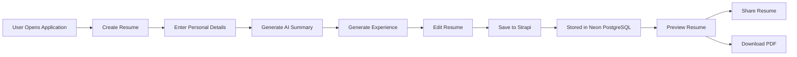
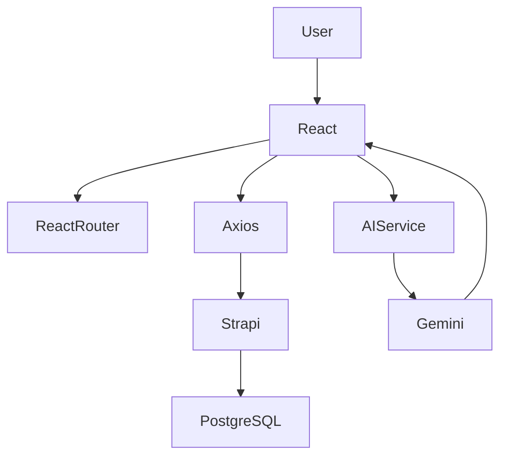
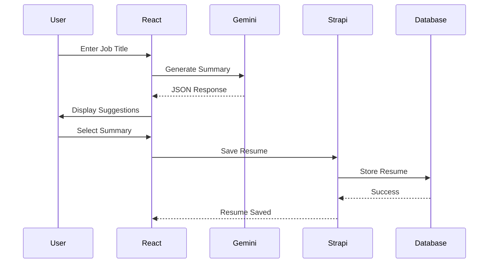
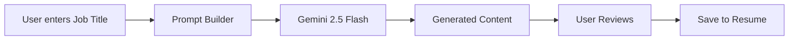
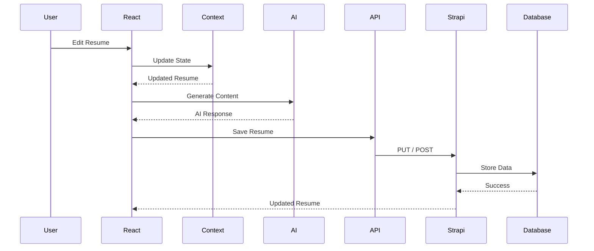

# 📄 ResumeFlow – AI-Powered ATS Resume Builder

<div align="center">


**An AI-powered resume builder that generates ATS-friendly resumes using Google Gemini AI with a modern React frontend and Strapi CMS backend.**

</div>

---

# 📑 Table of Contents

- [Project Overview](#-project-overview)
- [Key Features](#-key-features)
- [Project Goals](#-project-goals)
- [Technology Stack](#-technology-stack)
- [Architecture Overview](#-architecture-overview)
- [Application Workflow](#-application-workflow)
- [System Design](#-system-design)

---

# 📖 Project Overview

ResumeFlow is a modern AI-powered resume builder that helps job seekers create professional, ATS-friendly resumes within minutes.

Instead of manually writing resume content, users simply provide their information while Google Gemini AI intelligently generates:

- Professional summaries
- Work experience bullet points
- ATS-optimized resume content

The application combines a beautiful React interface with AI-assisted content generation and a Strapi backend for persistent resume storage.

Unlike traditional resume builders, ResumeFlow focuses on improving resume quality through AI while giving users complete control over editing every section before exporting or sharing.

---

# ✨ Key Features

## 🤖 AI Resume Generation

- AI-generated professional summaries
- AI-generated experience bullet points
- ATS-friendly resume content
- Multiple summary suggestions
- Smart prompt engineering using Google Gemini 2.5 Flash

---

## 📝 Resume Management

- Personal Information
- Professional Summary
- Work Experience
- Education
- Skills
- Projects
- Preview Resume
- Resume Sharing

---

## 🎨 Modern User Interface

- Responsive design
- Clean dashboard
- Reusable UI components
- Beautiful resume templates
- Tailwind CSS styling
- shadcn/ui components

---

## 💾 Backend Features

- Resume persistence
- Media management
- REST API
- Content management using Strapi
- PostgreSQL database (Neon)

---

## ⚡ Performance

- Fast Vite development server
- Optimized production build
- Efficient API communication
- Lazy UI rendering
- Minimal bundle size

---

# 🎯 Project Goals

The primary objectives of ResumeFlow are:

- Reduce the time required to create professional resumes.
- Improve resume quality using AI-assisted writing.
- Generate ATS-friendly content suitable for modern hiring systems.
- Provide an intuitive editing experience.
- Enable resume sharing through public links.
- Showcase modern frontend architecture and AI integration.

This project also serves as a portfolio-quality demonstration of modern web development practices including React, AI integration, REST APIs, and headless CMS architecture.

---

# 🛠 Technology Stack

## Frontend

| Technology      | Purpose             |
| --------------- | ------------------- |
| React 19        | User Interface      |
| Vite            | Build Tool          |
| React Router    | Client-side Routing |
| Tailwind CSS v4 | Styling             |
| shadcn/ui       | UI Components       |
| Axios           | API Requests        |
| Sonner          | Notifications       |
| React Hook Form | Forms               |
| HTML2PDF        | Resume Export       |

---

## Backend

| Technology | Purpose            |
| ---------- | ------------------ |
| Strapi 5   | Headless CMS       |
| PostgreSQL | Database           |
| Neon       | Cloud Database     |
| REST API   | Data Communication |

---

## AI

| Technology              | Purpose                   |
| ----------------------- | ------------------------- |
| Google Gemini 2.5 Flash | Resume Content Generation |
| Google GenAI SDK        | AI Integration            |

---

## Development Tools

- PNPM
- ESLint
- Git
- GitHub
- VS Code

---

# 🏗 Architecture Overview

ResumeFlow follows a modern client-server architecture.

```text
                     +----------------------+
                     |     React Client     |
                     |      (Vite App)      |
                     +----------+-----------+
                                |
                                |
                       Axios REST API
                                |
                                |
               +----------------+----------------+
               |                                 |
               |            Strapi API           |
               |                                 |
               +---------+---------------+--------+
                         |               |
                         |               |
               PostgreSQL Database    Gemini AI
                    (Neon)            (Google)
```

---

## High-Level Components

### Frontend

Responsible for:

- User Interface
- Form Management
- Resume Editing
- AI Requests
- Resume Preview

---

### Strapi Backend

Responsible for:

- Resume CRUD
- Database Operations
- Content Storage
- API Endpoints

---

### Google Gemini

Responsible for:

- Resume Summary Generation
- Experience Bullet Generation
- ATS-friendly Writing Assistance

---

### Neon PostgreSQL

Responsible for:

- Resume Storage
- User Data
- Resume Sections

---

# 🔄 Application Workflow



---

# 🏛 System Design



---

## AI Content Generation Flow



---

---

# 📁 Project Structure

```text
ResumeFlow/
│
├── client/                    # React + Vite Frontend
│   ├── public/                # Images & Static Assets
│   ├── src/
│   │   ├── components/        # Reusable UI Components
│   │   ├── constants/         # AI Prompts & Constants
│   │   ├── context/           # React Context API
│   │   ├── dashboard/         # Resume Builder Pages
│   │   ├── home/              # Landing Page
│   │   ├── lib/               # Utility Functions
│   │   ├── service/           # API & AI Services
│   │   ├── view-resume/       # Public Resume View
│   │   ├── App.jsx
│   │   └── main.jsx
│   │
│   ├── package.json
│   └── vite.config.js
│
├── server/                    # Strapi Backend
│   ├── config/
│   ├── database/
│   ├── src/
│   │   ├── api/
│   │   ├── components/
│   │   ├── extensions/
│   │   └── index.js
│   │
│   ├── package.json
│   └── .env
│
└── README.md
```

The project is intentionally separated into frontend and backend applications to provide clear boundaries between UI rendering, AI interactions, and persistent data storage.

---

# 🧩 Frontend Architecture

The frontend follows a component-driven architecture using React.

```text
src
│
├── components
│      ├── ui
│      ├── forms
│      ├── preview
│      └── shared
│
├── dashboard
│      ├── add-resume
│      ├── edit-resume
│      └── components
│
├── service
│      ├── GlobalApi.js
│      ├── AIModel.js
│      └── prompts.js
│
├── context
│      └── ResumeInfoContext.jsx
│
└── view-resume
```

### Responsibilities

### Dashboard

Responsible for creating and editing resumes.

---

### Components

Reusable UI used across multiple pages.

---

### Context API

Provides centralized resume state throughout the application.

---

### Services

Contains API requests and Google Gemini integration.

---

### View Resume

Responsible for rendering the final resume for sharing or downloading.

---

# 🗄 Backend Architecture

The backend is powered by **Strapi 5**, serving as a Headless CMS.

Responsibilities include:

- Resume CRUD operations
- Database persistence
- REST API
- Content validation
- Media handling

```text
React Client
      │
 REST API
      │
 Strapi
      │
 PostgreSQL (Neon)
```

Using Strapi significantly reduced backend boilerplate while allowing the project to focus on frontend experience and AI functionality.

---

# 🤖 AI Integration

ResumeFlow integrates **Google Gemini 2.5 Flash** to generate professional resume content.

Current AI capabilities include:

- Professional summaries
- Experience bullet points

Prompt engineering is used to ensure:

- ATS-friendly writing
- Consistent formatting
- HTML generation
- Structured JSON responses
- Professional language
- Resume best practices

Example workflow:



Unlike simple text generation, ResumeFlow uses carefully engineered prompts that produce deterministic outputs suitable for direct rendering within the application.

---

# 📦 Data Flow



This architecture ensures that generated AI content is first reviewed by the user before being persisted to the database.

---

# 🚀 Getting Started

## Prerequisites

Before running the project locally, ensure the following are installed:

- Node.js 20+
- PNPM
- Git
- PostgreSQL (or a Neon account)
- Google AI Studio API Key

---

## Clone Repository

```bash
git clone https://github.com/Ayyah-Coded/resume-flow.git

cd resume-flow
```

---

## Install Frontend

```bash

pnpm install
```

---

## Install Backend

```bash
cd ../server

pnpm install
```

---

## Start Development Servers

Frontend

```bash
pnpm dev
```

Backend

```bash
pnpm develop
```

The frontend will typically run on:

```text
http://localhost:5173
```

while Strapi runs on:

```text
http://localhost:1337
```

---

# ⚙ Environment Variables

## Frontend (.env)

```env
VITE_API_BASE_URL=http://localhost:1337/api

VITE_BASE_URL=http://localhost:5173

VITE_GOOGLE_API_KEY=your_google_ai_api_key
```

---

## Backend (.env)

```env
HOST=0.0.0.0

PORT=1337

DATABASE_CLIENT=postgres

DATABASE_URL=your_neon_connection_string
```

> **Important:** Never commit your `.env` files or API keys to version control. Store sensitive credentials securely and use environment variables for all secrets.

---

# 💻 Running the Application

Once both the frontend and backend have been configured, start each application in separate terminals.

## Start Strapi

```bash
cd server

pnpm develop
```

Expected output:

```text
Server running at:
http://localhost:1337
```

---

## Start React

```bash

pnpm dev
```

Expected output:

```text
Local:
http://localhost:5173
```

---

## Application Flow

1. Launch the Strapi backend.
2. Start the React frontend.
3. Create a new resume.
4. Fill in your personal information.
5. Generate AI-assisted content.
6. Save your resume.
7. Preview or share the completed resume.

---

# 🧠 AI Prompt Engineering

One of the core features of ResumeFlow is its prompt engineering strategy.

Instead of asking Gemini generic questions, the application uses carefully designed prompts that produce structured, deterministic responses suitable for immediate use inside the application.

Current prompts include:

- Resume Summary Generation
- Experience Bullet Generation

### Experience Prompt

The AI is instructed to:

- Generate ATS-friendly bullet points.
- Begin each bullet with strong action verbs.
- Focus on accomplishments and measurable impact.
- Return valid HTML only.
- Avoid Markdown and unnecessary explanations.

Example output:

```html
<ul>
  <li>
    Developed responsive web applications using React and modern JavaScript.
  </li>
  <li>
    Collaborated with cross-functional teams to deliver scalable software
    solutions.
  </li>
  <li>Optimized application performance, reducing page load time by 35%.</li>
</ul>
```

---

### Summary Prompt

The summary prompt generates multiple professional summaries tailored for different career stages.

Generated levels include:

- Entry Level
- Mid Level
- Senior Level

The response is returned as structured JSON, allowing the application to present multiple suggestions for users to choose from.

Example:

```json
[
  {
    "experience_level": "Entry Level",
    "summary": "..."
  },
  {
    "experience_level": "Mid Level",
    "summary": "..."
  },
  {
    "experience_level": "Senior Level",
    "summary": "..."
  }
]
```

This structured approach significantly improves reliability compared to free-form AI responses.

---

# 🌐 REST API Overview

The frontend communicates with Strapi using REST APIs through a centralized Axios client.

Typical operations include:

| Method | Purpose                 |
| ------ | ----------------------- |
| GET    | Retrieve resume details |
| POST   | Create new resume       |
| PUT    | Update resume sections  |
| DELETE | Remove resumes          |

Example request flow:

```text
React Component

        │

        ▼

GlobalApi.js

        │

        ▼

Axios Client

        │

        ▼

Strapi REST API

        │

        ▼

PostgreSQL
```

Centralizing API logic keeps components clean and improves maintainability.

---

# 🎨 User Interface

The frontend emphasizes simplicity, responsiveness, and accessibility.

Key UI features include:

- Responsive Layout
- Modern Dashboard
- Reusable Components
- Clean Typography
- AI Suggestion Cards
- Resume Preview
- Loading States
- Toast Notifications
- Form Validation

The application is built using:

- Tailwind CSS
- shadcn/ui
- Lucide React Icons

This combination provides a consistent and professional user experience while maintaining high performance.

---

# ⚡ Performance Optimizations

Several techniques were implemented to improve responsiveness and maintainability.

## Frontend

- Vite for extremely fast development builds.
- Component-based architecture.
- Context API for centralized state management.
- Reusable UI components.
- Optimized API requests.
- Minimal bundle size.

---

## Backend

- Headless CMS architecture.
- PostgreSQL indexing through Neon.
- RESTful API design.
- Efficient content management.

---

## AI

Prompt engineering reduces hallucinations by:

- Constraining response formats.
- Returning JSON instead of free text.
- Returning HTML where appropriate.
- Enforcing ATS-friendly writing patterns.

These techniques allow AI responses to be consumed directly by the application with minimal post-processing.

---

# 🔒 Security Considerations

Although ResumeFlow is a portfolio project, several security best practices were followed.

### Environment Variables

Sensitive credentials such as:

- Google AI API Key
- Database Connection String
- Strapi Secrets

are stored using environment variables instead of being hardcoded.

---

### API Communication

- Centralized Axios configuration
- JSON payload validation
- Proper error handling
- Async request management

---

### AI Safety

Prompt outputs are constrained through explicit formatting instructions, reducing malformed responses and making JSON parsing more reliable.

---

### Future Improvements

Potential production enhancements include:

- Authorization & Ownership
- Rate Limiting
- Request Validation
- Server-side AI Proxy
- Resume Versioning
- Audit Logging

These improvements would further strengthen the application's scalability and security in a production environment.

---

# 📈 Challenges & Lessons Learned

Building ResumeFlow involved solving several real-world engineering challenges that extended beyond simply creating a CRUD application.

## AI Prompt Engineering

One of the biggest challenges was designing prompts that consistently generated high-quality, ATS-friendly resume content.

Rather than relying on generic prompts, structured prompt engineering techniques were implemented to:

- Produce deterministic outputs.
- Return valid HTML or JSON.
- Minimize AI hallucinations.
- Improve response consistency.
- Generate content suitable for direct rendering within the application.

---

## State Management

Managing resume data across multiple editing sections required careful synchronization between local component state and global application state.

Using React Context API allowed each form section to remain modular while ensuring the entire resume stayed synchronized throughout the editing experience.

---

## Backend Integration

Integrating a headless CMS introduced additional considerations such as:

- REST API communication
- Content modeling
- Data persistence
- Error handling
- Environment configuration

This provided valuable experience working with modern API-driven architectures.

---

## Performance

The application was optimized by:

- Using Vite for lightning-fast development builds.
- Creating reusable UI components.
- Centralizing API logic.
- Separating concerns between frontend, backend, and AI services.

These architectural decisions resulted in a clean and maintainable codebase.

---

# 🚀 Future Improvements

Although ResumeFlow is fully functional, several enhancements are planned to further improve the user experience.

### Resume Features

- Multiple Resume Templates
- Resume Themes
- Drag-and-Drop Section Reordering
- Resume Version History
- Custom Fonts
- Custom Color Schemes

---

### AI Features

- AI Cover Letter Generator
- Resume ATS Score Analyzer
- Resume Improvement Suggestions
- Job Description Matching
- Keyword Optimization
- Interview Question Generator

---

### Export Options

- High-quality PDF Export
- DOCX Export
- Printable Resume Templates

---

### Technical Improvements

- TypeScript Migration
- Unit & Integration Testing
- CI/CD Pipeline
- Docker Support
- Cloud Deployment
- Backend Authentication
- Server-side AI Proxy
- Rate Limiting
- Request Validation

---

# 💡 Key Takeaways

ResumeFlow demonstrates practical experience with modern full-stack web development and AI integration.

Through this project, I gained hands-on experience with:

- Designing scalable React applications.
- Building reusable component architectures.
- Managing complex application state.
- Integrating AI into real-world workflows.
- Prompt engineering for structured AI responses.
- Working with REST APIs.
- Using Strapi as a headless CMS.
- Persisting data with PostgreSQL (Neon).
- Building responsive user interfaces with Tailwind CSS.
- Following modern JavaScript best practices.

Beyond the technical implementation, this project reinforced the importance of clean architecture, maintainable code, and thoughtful user experience design.

---

# 👨‍💻 Author

**Yahaya Hayatullahi**

A Full-Stack Software Engineer passionate about building modern, scalable web applications and mobile apps.

### Connect with me

- GitHub: **https://github.com/Ayyah-Coded**
- LinkedIn: **https://linkedin.com/in/yourprofile**
- Portfolio: **https://yourportfolio.com**

---

# 📄 License

This project is licensed under the **MIT License**.

You are free to use, modify, and distribute this project in accordance with the terms of the license.

See the **LICENSE** file for additional details.

---

<div align="center">

### ⭐ If you found this project helpful, consider giving it a star!

It helps others discover the project and supports future development.

**Thank you for visiting ResumeFlow! 🚀**

</div>
